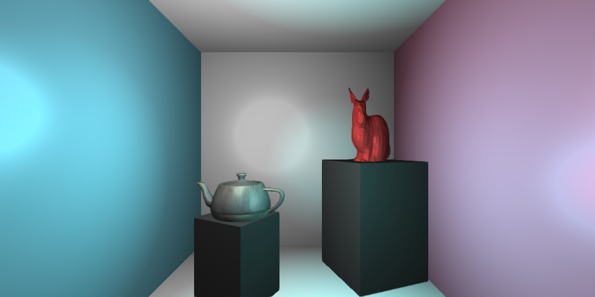

# Xylem

A browser based deferred renderer.

You can play with [xylem.js at github pages](http://zethraeus.github.io/xylem.js/index.html).

Status: Functional deferred rendering supporting multiple point lights.

## Potential to do:
* System for visualizing different matrix applications
* Proper map setting for ambient light
* SSAO
* Optional MRT support for Chrome dev branches
* Spot lights
* Shadow Maps

## Requirements:
* You'll need a modern desktop browser to comfortably use WebGL
* You'll need to have CoffeeScript installed and `cake` in your PATH

##Getting Xylem running:
* Clone this repository
* `cd xylem.js/`
* `git submodule init`
* `git submodule update`
* `cake build`
* `python -m SimpleHTTPServer 8888`
* Navigate to [localhost:8888](http://localhost:8888/) in a web browser
