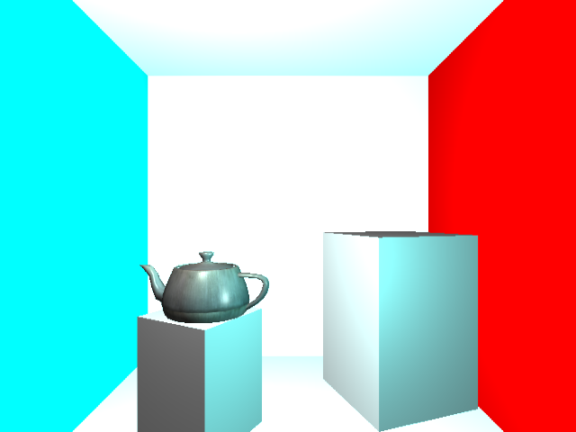

# Xylem

A browser based deferred renderer.

Status: Functional deferred rendering supporting multiple point lights.

Near term to do:
  * decrease number of geometry passes to two and minimize gbuffer.
  * clean up.
