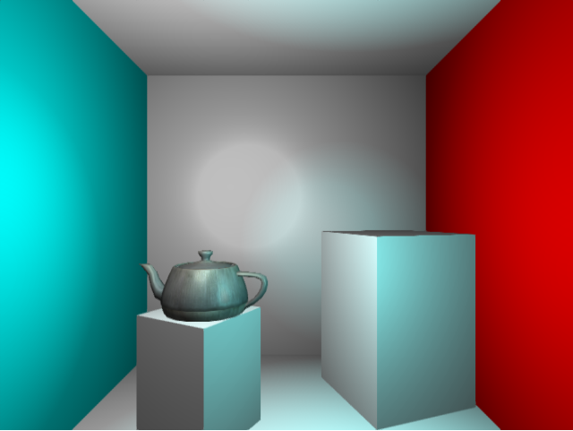

# Xylem

A browser based deferred renderer.

Status: Functional deferred rendering supporting multiple point lights.

Near term to do:
* Light attenuations
* Proper map setting for ambient light
* SSAO
* Optional MRT support for Chrome dev branches
* Spot lights
* Shadow Maps
