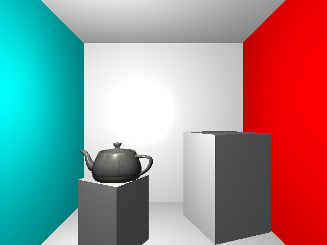

# Xylem

(Finally) A browser based deferred renderer\*.

\* That currently does three geometry passes and renders only one light. (As long as WebGL implementations lack support for the [multiple render targets extension](http://www.khronos.org/registry/webgl/extensions/WEBGL_draw_buffers/), more than one geometry pass will be required).

